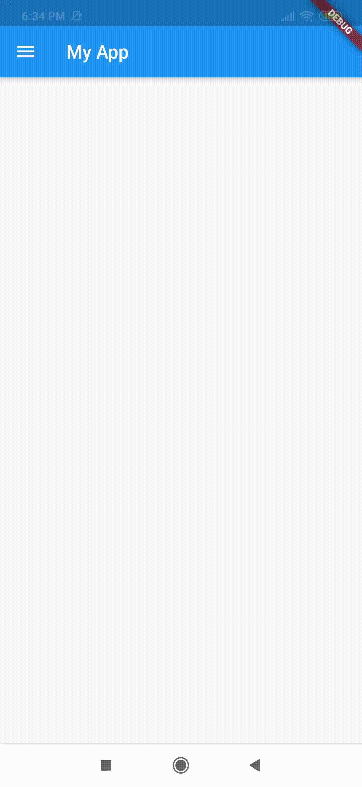

# Flutter

## Instalación

* En la web oficial de [Flutter](https://flutter.dev/docs/get-started/install) descargar el SDK de Flutter.


* Descomprimir el fichero.zip dentro del directorio _C:\src\\_


* Crear la variable de entorno para Flutter, como sigue:


* Crear un nuevo _Path_ con la dirección de _C:\src\flutter\bin_


* En la cmd ejecutar **flutter doctor** para verificar si se ha instalado correctamente.


# Instalar los _plugins_ de Flutter y Dart en Android Studio

1. Iniciar Android Studio.
2. Abrir _plugin preferences_ (Configure > Plugins).
3. Seleccionar el plugin de **Flutter** y click en **Install**.


4. Click en **Restart** cuando finalice.

# Crear un nuevo template

1. En Android Studio seleccionar _Start a new Flutter project_


2. Seleccionar Flutter application


3. Definir el nombre del proyecto, la ubicación del SDK de Flutter _C:\src\Flutter_ y la ubicación del proyecto.


4. Colocar el nombre del paquete y **Finalizar**.

5. Crear la clase principal **main()**. Además, las clases _MyApp_ y _State_

```dart
void main() {

}

class MyApp extends StatefulWidget{
  @override
  _State createState() => _State();
}

class _State extends State<MyApp>{
  @override
  Widget build(BuildContext context) {
    // TODO: implement build
  }
}
```

6. Completar los métodos con _Scaffold_ los _Widget_ por ejemplo:
```dart

import 'package:flutter/material.dart';

void main() {
  runApp(MaterialApp(
    home: MyApp(),
  ));
}

class MyApp extends StatefulWidget{
  @override
  _State createState() => _State();
}

class _State extends State<MyApp>{
  @override
  Widget build(BuildContext context) {
    // TODO: implement build
    return Scaffold(
      appBar: AppBar(
        title: Text('My App'),
      ),
      body: Container(
        child: Center(
          child: Text('Hola Mundo'),
        )
      )
    );
  }

}

```

7. Para crear un template con este código primero seleccionar todo el código y copiarlo. Luego ir a **File>Settings>Editor>Live Templates**


8. Seleccionar _Flutter_ luego en el botón derecho superior de **+** y escoger _1. Live template_

9. Colocar el nombre del template, una descripción y dentro de _Template text_ pegar el código.


10. Definir para **dart** como se indica en la imágen. Finalmente, dar click en **Apply**


11. Para hacer uso del template creado, simplemente, se escribe el nombre del template y se selecciona en la opción del autocompletado como se observa a continuación.


## Ejecutar el projecto

1. Iniciar el _Android Virtual Device_ o conectar un dispositivo Android al computador.

2. Ejecutar la App en dispositivo conectado.


## Simulaciones de proyectos

A continuación, se observan simulaciones de algunos proyectos realizados en Flutter:

1. Buttons: RaisedButton, FlatButton, IconButton, Tooltip


### Project: 

* [Buttons](/flutter_app_template)

#### Repositorios:

* [RaisedButton.dart](repository/Widget_simple_file/RaisedButton.dart)
* [FlatButton.dart](repository/Widget_simple_file/FlatButton.dart)
* [icon_button.dart](repository/Widget_simple_file/icon_button.dart)
* [Tooltip.dart](repository/Widget_simple_file/Tooltip.dart) 

2. Checkbox


### Project: 

* [Checkbox](/flutter_app_checkbox)

3. Switch


### Project: 

* [Switch](/flutter_app_switch)

4. RadioButton


### Project: 

* [RadioButton](/flutter_app_radio_button)

5. Date/Time picker


### Project: 

* [Date/Time picker](/flutter_app_date_picker)

6. Slider


### Project: 

* [Slider](/flutter_app_slider)

7. Drawer



### Project: 

* [Drawer](/flutter_app_drawer)

8. Snackbar


### Project: 

* [Snackbar](/flutter_app_snacbar)

9. Simple Dialog


### Project: 

* [Simple Dialog](/flutter_app_dialog)

10. Alert Dialog


### Project: 

* [Alert Dialog](/flutter_app_alertdialog)

11. Listview


### Project: 

* [Listview](/flutter_app_list)

12. Listview Dinamic


### Project: 

* [Listview Dinamic](/flutter_app_listview_dinamic)

13. Listview Dinamic


### Project: 

* [Listview Dinamic](/flutter_app_listview_dinamic)

14. Card


### Project: 

* [Card](/flutter_app_card)

